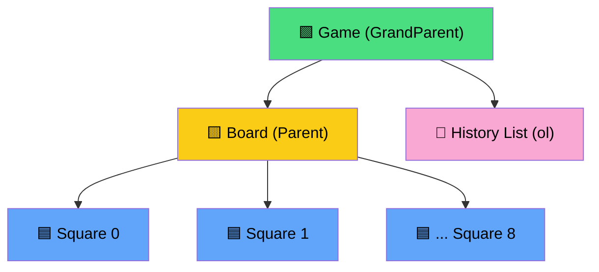
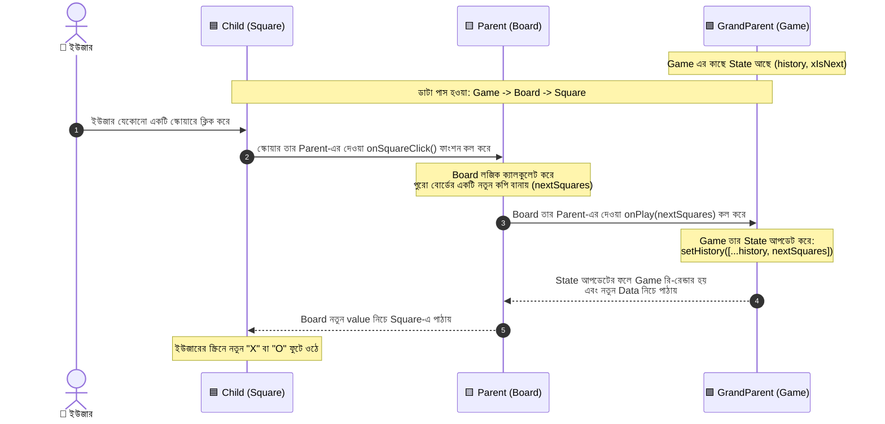
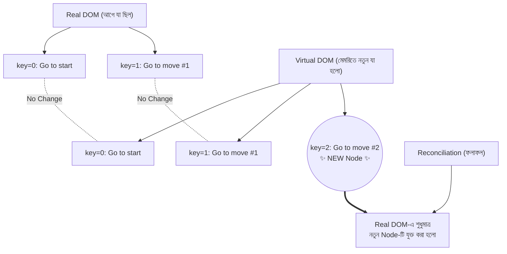
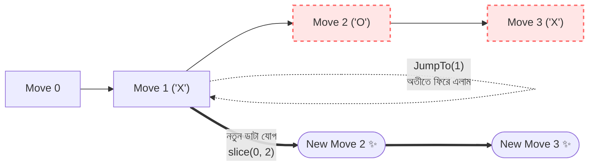

# 🎮 Tic-Tac-Toe App & React Learnings (Beginner's Guide)

This project is a classic Tic-Tac-Toe game built with React. Through this project, I completely understood how React components talk to each other. Here is a beginner-friendly breakdown of three core React concepts: **State Immutability**, **Lifting State Up**, and **Inverse Data Flow**.

---

## 🧠 1. State Immutability (স্টেট অপরিবর্তনশীলতা)

React-এ State হলো একটি কম্পোনেন্টের নিজস্ব মেমরি। যখন আমরা State আপডেট করি, তখন আমরা সরাসরি আগের ডাটা পরিবর্তন (mutate) করতে পারি না। আমাদের সবসময় আগের ডাটার একটি **হুবহু নতুন কপি (new copy)** তৈরি করে তারপর পরিবর্তন করতে হয়।

**সহজ উদাহরণ:** ধরুন, আপনার কাছে একটি খাতা আছে। আপনি আগের লেখা মুছে নতুন করে লিখবেন না, বরং খাতায় যা লেখা আছে তার একটি ফটোকপি করবেন, কপিতে নতুন লাইন যোগ করবেন, এবং আগের খাতার জায়গায় নতুন খাতাটি রেখে দেবেন।

**ভুল পদ্ধতি (Wrong - Direct Mutation):**
```jsx
// আমরা সরাসরি array-এর ভেতর নতুন ডাটা ঢোকাচ্ছি
history.push(nextSquares); 
setHistory(history); 
```
**সমস্যা কী?** React খুব দ্রুত কাজ করার জন্য ডাটার ভেতরের একেকটি আইটেম খুলে চেক করে না। সে শুধু ভ্যারিয়েবলটির **মেমরি অ্যাড্রেস (Reference)** চেক করে। আপনি যদি সরাসরি `push` করে ডাটা বদলান, মেমরি অ্যাড্রেস একই থেকে যায়। ফলে React ভাবে ডাটা পরিবর্তন হয়নি, তাই সে স্ক্রিন (UI) আপডেট বা **Re-render** করে না।

**সঠিক পদ্ধতি (Right - Immutability using Spread Operator):**
```jsx
// '...' (spread operator) দিয়ে আমরা history-র সব ডাটার একটি সম্পূর্ণ নতুন কপি বানালাম
setHistory([...history, nextSquares]); 
```
**কেন সঠিক?** এখানে একটি সম্পূর্ণ নতুন Array তৈরি হচ্ছে, যার মেমরি অ্যাড্রেস আলাদা। React যখন দেখে আগের অ্যাড্রেস এবং নতুন অ্যাড্রেস আলাদা, সে সাথে সাথে বুঝতে পারে পরিবর্তন হয়েছে এবং UI আপডেট (Re-render) করে।

---

## 🏗️ 2. Lifting State Up (স্টেট উপরে তোলা)

React-এ ভাই-বোন (Sibling components) অর্থাৎ পাশাপাশি থাকা দুটো Child component একে অপরের সাথে সরাসরি কথা বলতে পারে না। 

**সহজ উদাহরণ:** এই ৯টি `Square` হলো ৯ জন ভাই-বোন। তারা যদি নিজেদের কাছে নিজেদের ভ্যালু (State) জমিয়ে রাখে (সে 'X' নাকি 'O'), তবে কে গেম জিতেছে তা হিসাব করা অসম্ভব হয়ে যাবে। কারণ একজন জানে না অন্যজনের কাছে কী আছে। 

**আমাদের গেমের Component Tree Structure:**


**সমাধান:** 
আমরা এই সমস্যার সমাধানে State-কে তাদের কাছ থেকে কেড়ে নিয়ে তাদের Parent (মা-বাবা) অর্থাৎ `Board` বা `Game` component-এর কাছে নিয়ে এসেছি।
- **Single Source of Truth:** এখন সব ডাটা Parent-এর কাছে আছে। Parent সবাইকে বলে দেয় কোন ঘরে কী বসবে। 
- **Time Travel:** ভবিষ্যতে গেমের আগের চালে ফেরত যাওয়ার (History) জন্য আমরা ডাটাকে আরও এক ধাপ উপরে `Game` component-এ তুলেছি। 

---

## 🔄 3. One-Way Data Binding ও Inverse Data Flow

React-এ সবসময় ডাটা প্রবাহ হয় **উপর থেকে নিচে**। অর্থাৎ Parent component তার Child-কে Props-এর মাধ্যমে ডাটা দেয়। একে **One-Way Data Binding** (একমুখী ডাটা প্রবাহ) বলে। ঝর্ণার পানি যেমন শুধু নিচেই পড়ে, ডাটাও তেমনি Parent থেকে Child-এ যায়।

**প্রশ্ন:** তাহলে Child (যেমন `Square`)-এ ইউজার ক্লিক করলে Parent (`Board` বা `Game`) কীভাবে জানবে যে স্টেট বদলাতে হবে?

**সহজ উত্তর (Inverse Data Flow):** 
Parent শুধু ডাটাই দেয় না, সে Child-কে একটি **ফাংশন (Function / Walkie-Talkie)**-ও দিয়ে দেয়। 
- Parent বলে: "এই নাও ওয়াকিটকি (ফাংশন)। যখনই কেউ তোমাকে ক্লিক করবে, তুমি এই ওয়াকিটকিতে কল করে আমাকে জানিয়ে দেবে।"
- Child-এ ক্লিক হওয়ামাত্রই সে `onPlay` বা `onSquareClick` ফাংশনটি কল করে দেয়। 
- কলটি সরাসরি Parent-এ থাকা মেইন ফাংশনকে ট্রিগার করে এবং Parent তার State আপডেট করে নেয়।
- নিচ থেকে উপরে এই সিগন্যাল পাঠানোকেই **Inverse Data Flow** বলে।

---

## 📊 Workflow & State Flow Diagram

পুরো প্রক্রিয়াটি কীভাবে কাজ করে তার একটি ভিজ্যুয়াল ফ্লোচার্ট নিচে দেওয়া হলো। এখানে দেখা যাচ্ছে কীভাবে ডাটা এবং ফাংশন আদান-প্রদান হচ্ছে:



---

## 🌳 4. Understanding Virtual DOM & Diffing Algorithm 

আমাদের গেমে "Time Travel" বা আগের চালে ফেরার জন্য একটি লিস্ট (`<ol>`) আছে, যেখানে প্রত্যেক চালে নতুন একটি বাটন যোগ হয়:
- Go to start the Game
- Go to move # 1
- Go to move # 2

**প্রশ্ন:** প্রতিবার নতুন চাল দিলে তো `history.map()` ফাংশন পুরো Array-টাই নতুন করে তৈরি করে! তাহলে কি React ব্রাউজারে পুরো লিস্টটি বারবার মুছে ফেলে নতুন করে লেখে?

**উত্তর:** না! এখানেই React-এর জাদুকরী ক্ষমতা: **Virtual DOM** এবং **Diffing Algorithm** কাজ করে।

### কীভাবে কাজ করে? (Step-by-Step)
১. **Virtual DOM তৈরি:** আপনার কোড রান করার পর React সরাসরি স্ক্রিনে হাত দেয় না। সে মেমরির ভেতর আপনার UI-এর একটি ভার্চুয়াল বা নকল ট্রি (Tree) বা ম্যাপ তৈরি করে।
২. **Diffing Algorithm (পার্থক্য খোঁজা):** React তার মেমরিতে থাকা আগের ভার্চুয়াল ট্রি-এর সাথে নতুন ভার্চুয়াল ট্রি-এর তুলনা করে। 
৩. **The Magic of `key` Prop:** এই তুলনা করার সময় `key={move}` প্রোপার্টিটি ম্যাজিকের মতো কাজ করে। React দেখে: 
   - `key="0"` (Go to start) আগে ছিল, বদলায়নি।
   - `key="1"` (Go to move #1) আগে ছিল, বদলায়নি। 
   - শুধু মাত্র `key="2"` (Go to move #2) নামে নতুন একটি নোড (Node) যোগ হয়েছে!
৪. **Reconciliation (বাস্তবে আপডেট করা):** পার্থক্য বের করার পর React ব্রাউজারের আসল স্ক্রিনে (Real DOM) গিয়ে **শুধুমাত্র নতুন `<li>` ট্যাগটিকে স্ক্রিনে বসিয়ে (Insert) দেয়**। আগেরগুলোর গায়ে সে হাতও দেয় না!

### 📊 Virtual DOM Diffing-এর Tree Diagram

নিচের ডায়াগ্রামে দেখানো হলো কীভাবে React শুধু নতুন অংশটুকু শনাক্ত করে এবং আপডেট করে:


*এই প্রক্রিয়ার কারণেই React এত ফাস্ট! সে পুরো পেজ রিলোড বা রি-রেন্ডার না করে শুধুমাত্র পরিবর্তিত অংশটুকুই ব্রাউজারে আঁকে।*

---

## ⏳ 5. Time Travel Logic (অতীতে ফেরা ও ইতিহাস বদলানো)

Time Travel ফিচারটিতে আমরা মূলত দুটি কাজ করি: এক, আগের চালে ফিরে যাওয়া, এবং দুই, সেখান থেকে নতুন করে চাল দিলে পুরনো ভবিষ্যৎ মুছে ফেলা।

### ১. অতীতে ফিরে যাওয়া (`JumpTo` ফাংশন)
আমাদের কাছে পুরো গেমের ইতিহাস (history) একটি Array-তে সেভ করা থাকে। আমরা শুধু `currentMove` নামের একটি "বুকমার্ক" বা চিহ্নিতকারী ব্যবহার করি।

- যখন "Go to move # 1"-এ ক্লিক করি, আমরা ইতিহাস থেকে ২ বা ৩ নম্বর চাল মুছে ফেলি না।
- বরং আমরা শুধু আমাদের চোখ (বুকমার্ক) ১ নম্বর চালে নিয়ে যাই: `setCurrentMove(nextMove)`.
- এরপর কার টার্ন হবে তা ঠিক করি: `nextMove % 2 === 0` (জোড় চাল হলে 'X', বিজোড় হলে 'O')।

### ২. ভবিষ্যৎ পরিবর্তন করা (`slice` এর ব্যবহার)
ধরি, আপনি ১ নম্বর চালে ফিরে এসেছেন (currentMove = 1)। এরপরে আপনি ২ এবং ৩ নম্বর চালও দিয়েছিলেন, যা ইতিহাস (history) খাতায় লেখা আছে। এখন আপনি ১ নম্বর চালে দাঁড়িয়ে নতুন একটি চাল দিলেন! 
তাহলে তো আগের ২ এবং ৩ নম্বর ইতিহাস আর থাকতে পারবে না! 

এজন্য আমরা `slice` মেথডটি ব্যবহার করি:
```jsx
const newHistory = [...history.slice(0, currentMove + 1), nextSquares];
```
- **`history.slice(0, currentMove + 1)`**: এটি জাদুর কাঁচির মতো কাজ করে। এটি বর্তমান চাল (১) পর্যন্ত ইতিহাসকে রেখে দেয় এবং পরের সব ভুল ভবিষ্যৎগুলো (২, ৩) কেটে ফেলে দেয়।
- এরপর স্প্রেড অপারেটর `...` এবং `, nextSquares` দিয়ে আমরা নতুন ইতিহাস তৈরি করি। 

### 📊 Time Travel Diagram

নিচের চিত্রে দেখানো হলো কীভাবে অতীতে ফিরে গিয়ে নতুন ইতিহাস তৈরি হয় (The Multiverse Timeline!):



---

## 🛠️ 6. Technologies & Versions (ব্যবহৃত প্রযুক্তি)

এই প্রজেক্টটি তৈরি করার জন্য নিচের টেকনোলজি এবং ভার্সনগুলো ব্যবহার করা হয়েছে:
*   **React:** `v19.2.5`
*   **Vite:** `v8.0.10`
*   **Tailwind CSS:** `v4.2.4`
*   **Node.js:** Required (Latest LTS version recommended)

---

## 🚀 7. How to Run Locally (যেভাবে আপনার পিসিতে চালাবেন)

যে কেউ চাইলে টার্মিনাল বা কমান্ড প্রম্পট ব্যবহার করে এই প্রজেক্টটি খুব সহজেই নিজের পিসিতে ডাউনলোড করে চালাতে পারবেন। ধাপগুলো নিচে দেওয়া হলো:

**ধাপ ১:** রিপোজিটরিটি ক্লোন করুন
```bash
git clone https://github.com/your-username/tic-tac-toe.git
```

**ধাপ ২:** প্রজেক্ট ফোল্ডারে প্রবেশ করুন
```bash
cd tic-tac-toe
```

**ধাপ ৩:** প্রয়োজনীয় ডিপেন্ডেন্সি (Dependencies) প্যাকেজগুলো ইন্সটল করুন
```bash
npm install
```

**ধাপ ৪:** গেম চালুর জন্য লোকাল সার্ভার স্টার্ট করুন
```bash
npm run dev
```

সব ঠিক থাকলে টার্মিনালে একটি লিংক দেখতে পাবেন (যেমন: `http://localhost:5173/`)। ওই লিংকে ক্লিক করলেই ব্রাউজারে আপনার গেমটি চালু হয়ে যাবে! 🎉
