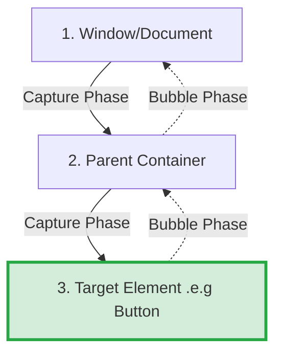
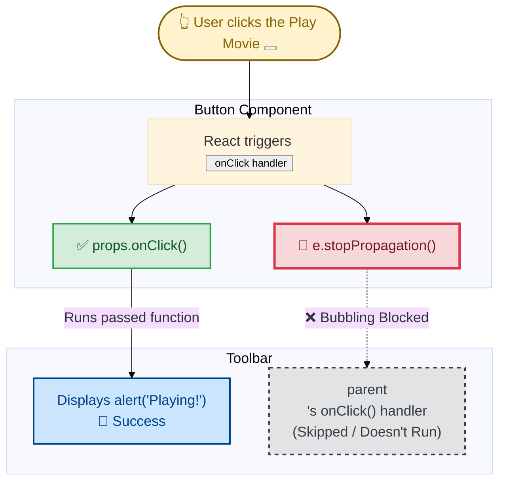
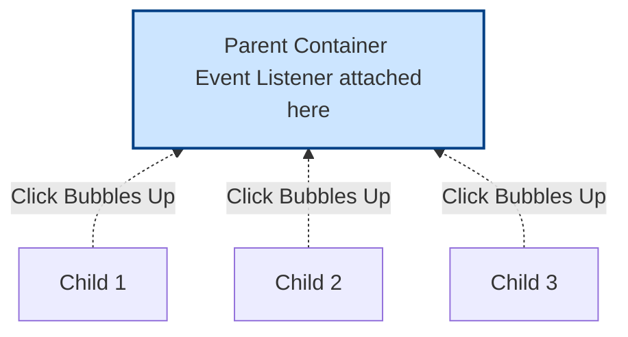

# 2.2 Responding to Events - Event Propagation & Delegation

This document covers two fundamental concepts in React and DOM event handling: **Event Propagation** and **Event Delegation**. Understanding these will help you handle events efficiently and avoid unexpected bugs.

## 2.2.1 What is Event Propagation?
**Event Propagation** is the mechanism that defines how an event travels through the Document Object Model (DOM) tree. When an event happens on an element (like a button click), it does not just act on that single element. Instead, it travels up and down the DOM hierarchy.

The Event Propagation process has three distinct phases:



1. **Capture Phase:** The event starts from the top (Window/Document) and goes down the DOM tree to find the target element.
2. **Target Phase:** The event reaches the exact element where the user clicked or interacted.
3. **Bubble Phase:** The event "bubbles" back up from the target element to the top of the DOM tree.

### 2.2.1.1 Event Bubbling in React
By default, React (`onClick`, `onChange`, etc.) listens to events in the **Bubble Phase**. Event handlers will also catch events from any children your component might have. We say that an event "bubbles" or "propagates" up the tree: it starts with where the event happened, and then goes up the tree.

**Example:**
This `<div>` contains two buttons. Both the `<div>` and each button have their own `onClick` handlers.

```jsx
export default function Toolbar() {
  return (
    <div className="Toolbar" onClick={() => {
      alert('You clicked on the toolbar!');
    }} style={{ padding: '20px', background: '#e0e0e0' }}>
      <button onClick={() => alert('Playing!')}>
        Play Movie
      </button>
      <button onClick={() => alert('Uploading!')}>
        Upload Image
      </button>
    </div>
  );
}
```
*If you click on either button, its `onClick` will run first (e.g., "Playing!"), followed by the parent `<div>`’s `onClick` ("You clicked on the toolbar!"). So two messages will appear. If you click the toolbar itself (the space around buttons), only the parent `<div>`’s `onClick` will run.*

### 2.2.1.2 Stopping Propagation (`e.stopPropagation`)
Event handlers receive an **event object** as their only argument. By convention, it’s usually called `e`, which stands for "event". You can use this object to read information about the event.

That event object also lets you stop the propagation. If you want to prevent an event from reaching parent components and triggering their handlers, you need to call `e.stopPropagation()`.

```jsx
function Button({ onClick, children }) {
  return (
    <button onClick={e => {
      e.stopPropagation(); // Stops the event from reaching the parent div
      onClick(); // Run the passed-down click handler
    }}>
      {children}
    </button>
  );
}

export default function Toolbar() {
  return (
    <div className="Toolbar" onClick={() => {
      alert('You clicked on the toolbar!');
    }} style={{ padding: '20px', background: '#ccc' }}>
      <Button onClick={() => alert('Playing!')}>
        Play Movie
      </Button>
      <Button onClick={() => alert('Uploading!')}>
        Upload Image
      </Button>
    </div>
  );
}
```
*Now, when you click the "Play Movie" button inside the `Toolbar`, only the "Playing!" alert will show. Since the `Button` component calls `e.stopPropagation()`, the parent `<div>`'s `onClick` will not fire.*

**Step-by-step execution when you click on a button:**
1. React calls the `onClick` handler passed to `<button>`.
2. That handler, defined in `Button`, does the following:
   - Calls `e.stopPropagation()`, preventing the event from bubbling further.
   - Calls the `onClick` function, which is a prop passed from the `Toolbar` component.
3. That function, defined in the `Toolbar` component, displays the button’s own alert.
4. Since the propagation was stopped, the parent `<div>`’s `onClick` handler does not run.

> 💡 **Best Practice Note: Naming Event Handler Props**
> You might wonder if it's okay to name a custom prop `onClick` since it's also a built-in DOM event name. Yes! In React, it's a standard practice. When creating wrapper components (like our `<Button>`), naming the prop `onClick` makes it intuitive because it behaves exactly like a regular HTML button for the developer using it. 
> 
> However, if your component performs a very specific app-level action (like playing a movie), you could also name it something domain-specific like `onPlayMovie`. The rule of thumb is: custom event prop names should start with `on`, followed by a capital letter.

### Visualizing `e.stopPropagation()`



As a result of `e.stopPropagation()`, clicking on the buttons now only shows a single alert (from the `<button>`) rather than the two of them (from the `<button>` and the parent toolbar `<div>`). Clicking a button is not the same thing as clicking the surrounding toolbar, so stopping the propagation makes sense for this UI.

---

## 2.2.2 What is Event Delegation?
**Event Delegation** is a design pattern where you attach a **single event listener** to a parent element instead of attaching multiple separate event listeners to everyday individual child elements. It leverages the concept of **Event Bubbling**.

Instead of assigning handling logic to each button or list item individually, you assign one listener to their container. When a child is clicked, the event bubbles up to the container, and you can figure out exactly which child was clicked using `event.target`.

### Flowchart of Event Delegation



### 2.2.2.1 Why use Event Delegation?
1. **Better Performance & Memory:** Creating 1000 event listeners for 1000 list items consumes a lot of memory. Delegating to one parent listener saves memory.
2. **Dynamic Elements:** If you add new child elements to the DOM later, they immediately inherit the event listener from the parent.

### 2.2.2.2 Event Delegation Example
Here’s how you can implement Event Delegation:

```jsx
export default function EventDelegationExample() {
  const handleParentClick = (e) => {
    // e.target refers to the exact element that was clicked
    // e.currentTarget refers to the element where the listener is attached (the ul)
    
    if (e.target.tagName === 'LI') {
      alert(`You clicked on: ${e.target.innerText}`);
    }
  };

  return (
    // Only ONE event listener on the parent <ul> 
    <ul onClick={handleParentClick} style={{ padding: '20px', background: '#ffeeba' }}>
      <li>Item One</li>
      <li>Item Two</li>
      <li>Item Three</li>
    </ul>
  );
}
```
*In this example, the `li` elements do not have their own event listeners. The event bubbles up to the `ul`, which handles it efficiently.*

## Summary Diff: `e.stopPropagation` vs `e.preventDefault`
- **`e.stopPropagation()`**: Stops the event from travelling (bubbling/capturing) up or down the DOM tree.
- **`e.preventDefault()`**: Stops the browser's default behavior (e.g., stops a form submission from refreshing the page, or a link from navigating).

---

## 2.2.3 What are Synthetic Events?
When you write an event handler in React (like `onClick={handleClick}`), the `e` (event object) that is passed to your function is **not** the standard browser's native DOM event. Instead, it is a **Synthetic Event** (specifically `SyntheticBaseEvent`).

React wraps the native browser events in its own `SyntheticBaseEvent` object to ensure **cross-browser consistency**. Different browsers (Chrome, Firefox, Safari) sometimes handle events slightly differently under the hood. React normalizes these differences, giving you a unified API that works exactly the same way everywhere.

### 2.2.3.1 How it works
Even though it's wrapped, a Synthetic Event has the same interface as a native event, including methods like `e.stopPropagation()` and `e.preventDefault()`. If, for some advanced reason, you absolutely need the underlying browser event object, you can access it via `e.nativeEvent`.

```jsx
export default function SyntheticEventExample() {
  const handleClick = (e) => {
    // 1. This is the React Synthetic Event wrapper
    console.log("React Synthetic Event:", e);
    
    // 2. This is the actual native DOM event from the browser
    console.log("Native DOM Event:", e.nativeEvent);

    // 3. Methods like these work reliably across all browsers thanks to the wrapper
    e.preventDefault();
    e.stopPropagation();
  };

  return (
    <button onClick={handleClick} style={{ padding: '10px', background: '#28a745', color: '#fff', border: 'none' }}>
      Inspect Event Object
    </button>
  );
}
```

**Step-by-step what happens when you click this button:**
1. You click the button. 
2. The browser generates a raw native event.
3. React intercepts this native event at the root node (using Event Delegation).
4. React wraps it up into a `SyntheticBaseEvent` to iron out browser quirks.
5. React passes this new `e` object into your `handleClick` function.

---

## 2.2.4 A Real-Life Analogy for Event Propagation
To make **Event Propagation** (specifically Bubbling) unforgettable, let’s imagine a corporate office structure:

1. **You** (the `<button>`) find a critical bug in the code. You shout, *"I found a bug!"*
2. **Your Manager** (the parent `<div>`) hears you through the thin walls and automatically repeats, *"My team found a bug!"*
3. **The CEO** (the `Window / Document`) hears the commotion and announces, *"Our company found a bug!"*

This chain reaction is exactly how **Event Bubbling** works. 
If you decide to use `e.stopPropagation()`, it is the equivalent of **closing your office door**. You still shout *"I found a bug!"* (your button's `onClick` runs), but the Manager and the CEO never hear it (the parent containers' handlers are skipped). The event stops with you.

---

## 2.2.5 Prototypes in JavaScript Events (Deep Dive)
When you log the `e` (Event Object) into your browser's console, you might wonder: *"Where do methods like `e.stopPropagation()` and `e.preventDefault()` actually come from? Are they unnecessarily copied into every single click event?"*

The answer lies in a core JavaScript concept called the **Prototype**, which heavily connects to how Synthetic Events are structured.

### 2.2.5.1 What is a Prototype?
In JavaScript, a **Prototype** is essentially a "blueprint" or a "parent template" from which other objects inherit methods and properties. 

If React had to recreate and attach the `stopPropagation` function to every single event object (every time you hover or click), it would crash the browser by using too much computer memory. Instead, React stores these methods **only once** inside a master blueprint called the `SyntheticBaseEvent.prototype`.

### 2.2.5.2 How Prototypes work during an Event
Let's see an example of how the Prototype Chain jumps into action when you click a button:

```jsx
export default function PrototypeExample() {
  const handleClick = (e) => {
    // 1. Calling the method
    e.stopPropagation();

    // 2. If you inspect 'e' in the console, you won't see stopPropagation properties sitting directly on it!
    console.dir(e); 
    
    // 3. Instead, it lives hidden inside its Blueprint (Prototype)
    console.log("Blueprint:", Object.getPrototypeOf(e));
  };

  return (
    <button onClick={handleClick} style={{ padding: '10px', background: '#17a2b8', color: '#fff', border: 'none' }}>
      Test Prototype
    </button>
  );
}
```

**Step-by-step execution under the hood:**
1. You click the button, and React creates an event object `e`. This object contains only basic, specific data (like the exact time you clicked, or the X/Y coordinates of your mouse).
2. Inside your code, you execute `e.stopPropagation()`.
3. JavaScript looks inside the `e` object and says, *"I don't see a `stopPropagation` method attached directly here!"*
4. JavaScript then automatically looks up the **Prototype Chain** (the blueprint that created `e`), which is `SyntheticBaseEvent`.
5. JavaScript successfully finds `stopPropagation` residing on the prototype, borrows it, and executes it.

```mermaid
flowchart TD
    ObjectE[Event Object 'e' \n (Contains lightweight specific data: click time, X/Y coords)] -->|Looks up for shared methods| Blueprint[SyntheticBaseEvent Prototype \n (Contains heavy methods: stopPropagation, preventDefault)]
    
    style ObjectE fill:#cce5ff,stroke:#004085,stroke-width:2px
    style Blueprint fill:#d4edda,stroke:#28a745,stroke-width:2px
```

By leveraging **Prototypes**, React ensures your app remains blazingly fast and uses very small amounts of memory, no matter how many thousands of events are fired by the user!

---

## 2.2.6 Preventing Default Behavior (`e.preventDefault`)
Some browser events have a built-in default behavior associated with them. The most common example is a `<form>` submit event. When a button inside a form is clicked, the browser's default behavior is to reload the whole page and send a request. 

In a modern React application (Single Page Application), we usually want to handle the submission ourselves using JavaScript, without reloading the page.

### 2.2.6.1 Without `e.preventDefault()` (Page Reloads)
```jsx
export default function SignupWithReload() {
  return (
    // This will alert, but then immediately refresh the page!
    <form onSubmit={() => alert('Submitting!')}>
      <input type="text" placeholder="Enter name" />
      <button>Send</button>
    </form>
  );
}
```

### 2.2.6.2 With `e.preventDefault()` (No Reload)
To stop this default behavior, you call `e.preventDefault()` on the event object.

```jsx
export default function SignupWithoutReload() {
  return (
    <form onSubmit={e => {
      // Stops the browser from refreshing the page
      e.preventDefault();
      alert('Submitting!');
    }}>
      <input type="text" placeholder="Enter name" />
      <button>Send</button>
    </form>
  );
}
```

**Step-by-step execution:**
1. User clicks the "Send" button inside the form.
2. The browser automatically fires the `submit` event on the `<form>`.
3. React intercepts it and passes a `SyntheticBaseEvent` (`e`) to the `onSubmit` handler.
4. `e.preventDefault()` is executed, telling the browser: *"Stop! Do not reload the page."*
5. The `alert` runs and the data can now be processed locally via JavaScript.

> ⚠️ **Warning: Don’t confuse `e.stopPropagation()` and `e.preventDefault()`.**
> They are both useful, but completely unrelated:
> - **`e.stopPropagation()`** stops the event handlers attached to the tags *above* from firing. (Stops the event from bubbling up the DOM tree).
> - **`e.preventDefault()`** prevents the *default browser behavior* for the few events that have it (like form submissions, or opening links).

---

## 2.2.7 Can Event Handlers Have Side Effects?
Absolutely! Event handlers are the best place for **side effects**.

Unlike React rendering functions (which must be pure and should only return JSX without mutating anything), event handlers **don’t need to be pure**. This makes them the perfect place to change something when answering to user actions—for example:
- Changing an input’s value in response to typing.
- Updating a list in response to a button press.
- Making an API request to a server.

However, in order to change some information inside your UI, you first need some way to store and remember it. In React, this is done by using **State**, a component’s memory. You will learn all about `useState` in the upcoming modules.

---

## 2.2.8 What exactly is a Side Effect?
In programming, and especially in React, a **Side Effect** is any operation that affects something outside the scope of the function being executed.

React's core job is to take your data (props/state) and turn it into UI (JSX). This process is called **Rendering**. React expects the rendering process to be **Pure**—meaning if you give it the same inputs (props), it should return the exact same UI without changing anything else in your computer, network, or browser.

However, a real-world application cannot be 100% pure. You need to communicate with the "outside world" to make the app useful.

**Common examples of Side Effects include:**
1. Fetching data from a server or API.
2. Reading or writing to the browser's `localStorage`.
3. Manually changing the browser's DOM (e.g., `document.title = "Hello"`).
4. Setting up a timer using `setTimeout` or `setInterval`.

### 2.2.8.1 Where do Side Effects belong in React?
Because rendering must be pure, you **cannot** put side effects directly inside the main body of your component. Instead, React gives you two "safe spots" to run them:

1. **Event Handlers:** (The Best Place) Triggered by user actions like `onClick` or `onSubmit`.
2. **The `useEffect` Hook:** Triggered automatically by React *after* the component has successfully painted the UI on the screen. (You will learn more about this hook later securely).

### 2.2.8.2 Code Example of safely using Side Effects
Here is a component that safely runs side effects in both an Event Handler and `useEffect`.

```jsx
import { useEffect, useState } from 'react';

export default function UserProfile() {
  const [user, setUser] = useState(null);

  // ❌ WRONG: Do NOT put side effects directly in the render body!
  // fetch("/api/user"); 
  // document.title = "User Profile"; 

  // ✅ SAFE SPOT 1: Using useEffect (runs AFTER the screen is painted)
  useEffect(() => {
    // Side Effect A: Changing the DOM outside of React's root
    document.title = "User Profile View"; 
    
    // Side Effect B: Fetching data from an external server
    fetch("https://jsonplaceholder.typicode.com/users/1")
      .then(res => res.json())
      .then(data => setUser(data));
  }, []); // The empty array means "run this only once when the component mounts"

  // ✅ SAFE SPOT 2: Inside an Event Handler (runs on user action)
  const handleSaveData = () => {
    // Side Effect C: Modifying the browser's local storage
    localStorage.setItem("savedUser", JSON.stringify(user));
    
    // Side Effect D: Showing a native browser alert
    alert("User data saved to local storage!");
  };

  return (
    <div style={{ padding: '20px', border: '1px solid #ccc' }}>
      <h1>{user ? user.name : "Loading profile..."}</h1>
      <button onClick={handleSaveData} disabled={!user}>
        Save to Local Storage
      </button>
    </div>
  );
}
```

**Step-by-step execution of how Side Effects flow:**
1. **Initial Render (Pure):** React calls the `UserProfile` function. It sees `user` is currently `null` and returns the `<h1/>` with "Loading profile...". *No side effects happen yet.*
2. **Commit Phase:** React updates the actual browser screen so the user sees "Loading profile...".
3. **`useEffect` triggers:** Now that the UI is successfully painted, React runs the code inside `useEffect`. It changes `document.title` and sends a `fetch` request to a server.
4. **State Update:** The server replies with data. `setUser()` is called, which tells React to re-render the component.
5. **Second Render (Pure):** React calls `UserProfile` again. This time `user` has data. It returns `<h1>Leanne Graham</h1>`. React updates the screen.
6. **User Interaction:** The user clicks the "Save to Local Storage" button.
7. **Event Handler triggers:** React runs `handleSaveData`, which reaches out to the browser's `localStorage` and triggers an `alert` pop-up.
